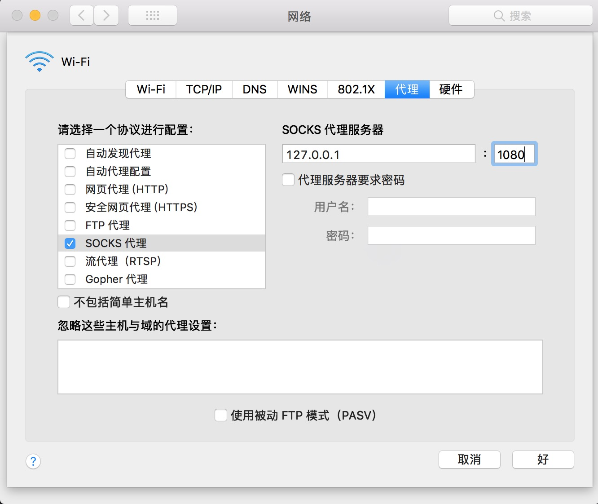

# node.js socks5 server

基于 node.js 与 socks5 协议的，**简单**穿墙服务实践

[wikipedia socks5 协议内容](https://zh.wikipedia.org/wiki/SOCKS)

### 功能点

- [x] 域名代理
- [ ] ipv4代理
- [ ] ipv6代理
- [x] handshake 阶段
- [ ] auth 验证
- [x] request 阶段
- [x] 双关通信
- [ ] 双关通信，包引入加密算法

### go 版本

[go github](https://github.com/Kyoloro/go-socks5)

### 配置

- node v6.10.2

### 启动

```sh
> node main.js
```

### macOS `socks5` 代理

